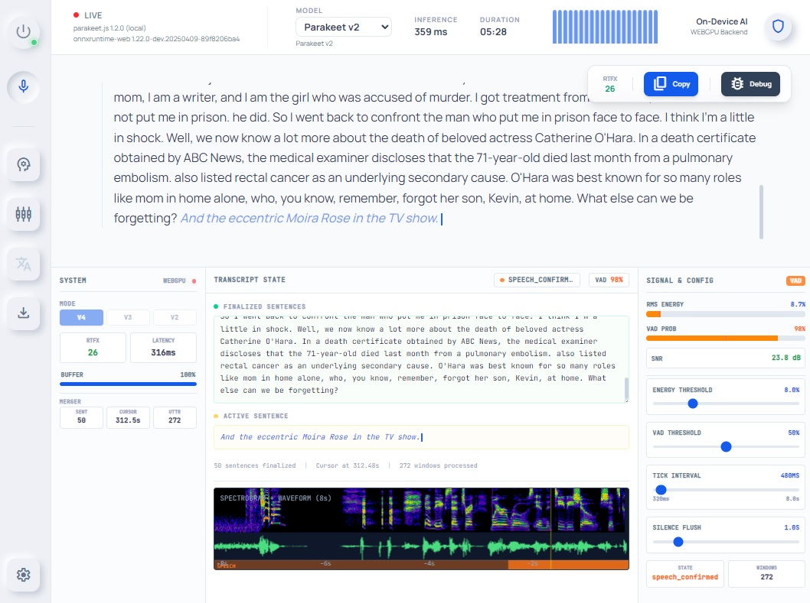

# Boncuk.js

Real-time speech-to-text transcription in the browser, powered by [Parakeet.js](https://github.com/ysdede/parakeet.js).



## Overview

Boncuk.js is a real-time speech-to-text application built with SolidJS, Vite, and Tailwind CSS. It runs NVIDIA NeMo Parakeet TDT models in the browser via WebGPU/WASM through Parakeet.js, with no backend required.

**Default pipeline (v4):** Utterance-based streaming with a centralized BufferWorker (multi-layer time-aligned buffer), TEN-VAD (WASM) for inference VAD, and HybridVAD (energy-based) for UI. WindowBuilder and UtteranceBasedMerger handle sentence finalization and mature/immature text. Legacy per-utterance (VAD-defined segments) mode is still available. See [docs/ARCHITECTURE.md](docs/ARCHITECTURE.md) and [.serena/memories/v4-utterance-pipeline-refactor.md](.serena/memories/v4-utterance-pipeline-refactor.md) for details.

### What's new in 1.0

- **v4 pipeline as default** – BufferWorker, TEN-VAD, WindowBuilder, UtteranceBasedMerger; sentence finalization via wink-nlp.
- **Canvas waveform** – Replaced 32 DOM bars with a single canvas renderer, removing the main 60fps layout/paint hotspot.
- **Zero-allocation buffer reads** – RingBuffer `readInto(target)` and pre-allocated waveform/mel buffers to cut GC and main-thread cost.
- **Debug panel** – RTFx (1/RTF) and latency with last-N averages; LayeredBufferVisualizer (mel heatmap + waveform) with pre-allocated ImageData and ResizeObserver cache; finalized sentences auto-scroll.
- **Mel spectrogram** – Fixed dB scaling to prevent gain hunting; black-to-red gradient colormap in the debug visualizer.
- **Security** – Content Security Policy (CSP) and dependency cleanup (e.g. removed unused wavefile, lz4js).

### Key features

- **Zero-backend transcription** – WebGPU/WASM inference runs entirely client-side
- **Real-time audio** – VAD-based speech detection (energy + optional TEN-VAD WASM)
- **Pipeline-parallel mel** – Dedicated Web Worker for continuous mel spectrogram; pure JS preprocessor (no ONNX), validated against NeMo
- **Incremental decoder cache** – Skips re-decoding overlapping prefix frames
- **Live UI** – Canvas waveform, mel heatmap in debug panel, SNR meter, auto-scroll for finalized sentences
- **Model management** – WebGPU/WASM backend selection, sideloading from HuggingFace
- **Gemini integration** – Post-processing and analysis of transcribed text

---

## Performance

Measured on a desktop with 12-thread CPU and WebGPU-capable GPU (Feb 2026):

| Metric | Before optimization | After optimization |
|--------|----------------------|---------------------|
| **Preprocess** | 181 ms | **0.0 ms** (precomputed by mel worker) |
| **Encode** | 468 ms | **160-178 ms** |
| **Decode** | 133 ms | **19-99 ms** |
| **Total per chunk** | 787 ms | **187-265 ms** |
| **Real-time factor** | 6.3x | **19-27x** |

Preprocessing is fully offloaded via the mel worker. See [docs/mel-worker-architecture.md](docs/mel-worker-architecture.md) for details.

---

## Architecture

### Multi-worker pipeline

```
Main thread (UI)
  ├── AudioEngine → mic → 80 ms PCM chunks (resample to 16 kHz)
  │     ├── AudioWorklet → raw audio
  │     └── onAudioChunk → MelWorker, HybridVAD, TenVADWorkerClient, BufferWorker (audio)
  ├── BufferWorkerClient → multi-layer store (audio, mel, energyVad, inferenceVad); fire-and-forget writes, promise reads
  ├── MelWorkerClient → audio to mel worker; features queried for inference windows
  ├── TenVADWorkerClient → audio to TEN-VAD worker; inference VAD into BufferWorker
  └── TranscriptionWorkerClient → v4Tick, BufferWorker (hasSpeech), WindowBuilder, inference

Mel worker
  └── Continuous mel: pre-emphasis → STFT → power → mel filterbank → log; on request: normalize window → features

Buffer worker
  └── Time-aligned layers (16 kHz sample offsets): hasSpeech(energyVad | inferenceVad), getSilenceTail, queryRange

TEN-VAD worker
  └── ten-vad WASM (~278 KB); 256-sample hops; probabilities → BufferWorker inferenceVad layer

Inference worker
  ├── ModelManager → Parakeet.js (WebGPU/WASM)
  ├── WindowBuilder → cursor-based window (min/max duration, hasSpeech from BufferWorker)
  ├── UtteranceBasedMerger → sentence finalization, mature/immature text
  └── parakeet.js transcribe() with precomputedFeatures
      ├── Encoder (WebGPU) → ~160 ms for 5 s audio
      └── Decoder (WASM) → 20-100 ms by text length
```

### Main optimizations

1. **Mel worker** – Mel runs in a separate worker; when inference triggers, normalized features are ready (no preprocess wait).
2. **Pure JS preprocessor** – Replaces ONNX `nemo128.onnx`; validated against NeMo (max error < 4e-4).
3. **Incremental decoder cache** – Caches decoder state at prefix boundaries (~80% decoder savings).
4. **Streaming window** – 5.0 s window / 3.5 s overlap / 1.5 s trigger (~30% less work per chunk).
5. **Queue-based chunk processing** – Latest-only queue when inference is busy.
6. **Optional log probs** – `returnLogProbs` off by default to save softmax cost.
7. **v4 pipeline** – BufferWorker, TEN-VAD, WindowBuilder, UtteranceBasedMerger; see [.serena/memories/v4-utterance-pipeline-refactor.md](.serena/memories/v4-utterance-pipeline-refactor.md).
8. **Canvas waveform** – Single canvas instead of DOM bars; fixed gain and clamp.
9. **Zero-allocation reads** – RingBuffer `readInto()`, pre-allocated waveform and ImageData for visualizers.
10. **ResizeObserver cache** – Replaces per-frame `getBoundingClientRect()` to avoid reflows.

---

## Getting started

### Prerequisites

- Node.js 18+ and npm

### Install

```bash
npm install
```

### Develop

```bash
npm run dev          # HTTPS dev server (for microphone)
npm run dev:local    # HTTP on localhost:3100 (faster, local only)
```

### Test

```bash
npm test             # All tests (~116; Vitest pool: forks)
npm run test:watch   # Watch mode
```

### Build

```bash
npm run build
npm run serve        # Preview production build
```

---

## Test suite

About 116 tests across 10 files for mel processing, v4 pipeline, and workers. Run: `npm test -- --run`. See [.serena/memories/v4-test-suite.md](.serena/memories/v4-test-suite.md) for v4 coverage.

| Test file | Scope | Description |
|-----------|--------|-------------|
| `mel-math.test.ts` | Unit | Mel (FFT, filterbank, normalization); 37 tests |
| `mel.worker.test.ts` | Integration | Mel worker load and messages; 9 tests |
| `mel-e2e.test.ts` | E2E | Real WAV + ONNX reference; 13 tests |
| `preprocessor-selection.test.ts` | Unit | Preprocessor selection (nemo128 skipped when backend=js); 12 tests |
| `VADRingBuffer.test.ts` | Unit | VAD ring buffer write/read, hasSpeech, silence tail, reset; 15 tests |
| `buffer.worker.test.ts` | Integration | BufferWorker INIT, HAS_SPEECH, GET_SILENCE_TAIL, RESET; 6 tests |
| `energy-calculation.test.ts` | Unit | Peak + 6-sample SMA energy; 4 tests |
| `WindowBuilder.test.ts` | Unit | WindowBuilder with mock ring buffer; 11 tests |
| `tenvad.worker.test.ts` | Integration | TEN-VAD worker INIT, RESET, PROCESS; 4 tests |
| `TenVADWorkerClient.test.ts` | Unit | TenVADWorkerClient ready, init reject, dispose; 5 tests |

**Validations:** Mel filterbank vs ONNX < 2.6e-7; full mel pipeline vs ONNX < 3.6e-4 max, 1.1e-5 mean; real audio (life_Jim.wav) 254 frames @ 120x realtime; preprocessor selection when `preprocessorBackend='js'`; determinism; v4 components covered.

---

## Project structure

```
src/
├── App.tsx                              # v4 orchestration (v4Tick, toggleRecording)
├── lib/
│   ├── audio/                           # AudioEngine, mel.worker, MelWorkerClient, mel-math, RingBuffer
│   ├── buffer/                          # buffer.worker, BufferWorkerClient (v4 layers)
│   ├── vad/                             # tenvad.worker, TenVADWorkerClient, HybridVAD, VADRingBuffer
│   ├── transcription/                   # ModelManager, WindowBuilder, UtteranceBasedMerger, transcription.worker
│   └── model/                           # ModelService (loading/sideloading)
├── components/                          # LayeredBufferVisualizer, Waveform, DebugPanel, etc.
└── stores/
    └── appStore.ts                      # v4 state: matureText, immatureText, vadState, ...
```

---

## Technology stack

| Component | Technology |
|-----------|------------|
| **UI** | SolidJS |
| **Build** | Vite |
| **Styling** | Tailwind CSS |
| **ASR** | [Parakeet.js](https://github.com/ysdede/parakeet.js) (ONNX Runtime Web) |
| **Inference** | WebGPU (encoder) + WASM (decoder) |
| **Mel** | Pure JavaScript (validated vs NeMo ONNX) |
| **VAD** | HybridVAD (energy); optional TEN-VAD WASM ([ten-vad](https://github.com/TEN-framework/ten-vad)) |
| **Sentences** | wink-nlp + wink-eng-lite-web-model |
| **Tests** | Vitest + @vitest/web-worker + happy-dom (pool: forks) |
| **Audio** | Web Audio API + AudioWorklet |

---

## Deployment

Build and deploy the `dist` folder to any static host (Netlify, Vercel, GitHub Pages):

```bash
npm run build
```

The app is fully client-side; no server is required for transcription.

---

## Documentation and context

| Doc | Description |
|-----|-------------|
| [docs/ARCHITECTURE.md](docs/ARCHITECTURE.md) | Per-utterance vs v4 streaming; VAD and audio flow |
| [docs/mel-worker-architecture.md](docs/mel-worker-architecture.md) | Mel worker pipeline and performance |
| [PROJECT_MEMORY.md](PROJECT_MEMORY.md) | Decisions and agent context (Serena MCP) |
| [LOCAL_DEV_SETUP.md](LOCAL_DEV_SETUP.md) | Local Parakeet.js source for development |
| [GEMINI.md](GEMINI.md) | Project context for Gemini |
| [MULTI_AGENT_SETUP.md](MULTI_AGENT_SETUP.md) | Multi-agent and Cursor/Serena setup |
| [AGENTS.md](AGENTS.md) | Available skills and agent usage |

**Serena memories** (`.serena/memories/`): [v4-utterance-pipeline-refactor.md](.serena/memories/v4-utterance-pipeline-refactor.md), [v4-test-suite.md](.serena/memories/v4-test-suite.md), [boncukjs-implementation-status.md](.serena/memories/boncukjs-implementation-status.md), [waveform-optimization.md](.serena/memories/waveform-optimization.md), [visualization-fixes.md](.serena/memories/visualization-fixes.md), [mel-producer-architecture.md](.serena/memories/mel-producer-architecture.md), [preprocessing-optimization.md](.serena/memories/preprocessing-optimization.md), [synchronization-fix.md](.serena/memories/synchronization-fix.md), [vad-correction-peak-energy.md](.serena/memories/vad-correction-peak-energy.md).
